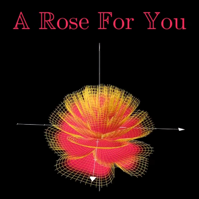

----------------------------------------------------------------

# 3D Rose

> [Video](https://www.facebook.com/reel/1989505635151204)
> [Math with Muza](https://www.facebook.com/profile.php?id=61574894202180)
> [Nav Links](./rose.nav)

----------------------------------------------------------------

$$
\rho(\theta) = \frac{\pi}{2}e^\frac{-\theta}{8\pi}
$$

$$
X(\theta) = 1 - \frac{1}{2}( \frac{5}{4}( 1 - \frac{\theta \mod {2\pi}}{\pi} )^2 - \frac{1}{4} )^2
$$

$$
{( x,y )} = (r\sin{\theta}, r\cos{\theta})
$$

$$
{( z )} = X(x\cos{\rho} - y\sin{\rho})
$$

----------------------------------------------------------------

# Example

  

----------------------------------------------------------------

# Navigation

> [Folder Tree](./tree.php)
> [File System](./)

----------------------------------------------------------------

