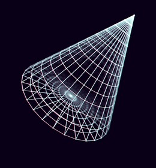

<style>
html, body {
	font : 12pt verdana, sans-serif;
}
body {
	padding : 10ch 15ch;
}
</style>

# Drawing a Cone

<div>
  
</div>

# Choose Dimensions

First, we defined the essential metrics:

- Radius at Base
- Height

# Choose Facet Measures

This is adequate for the math. However, unless we ray tracing,
we'll need some more metrics that describe a faceted convex
solid 3D shape.

- Side (and Vertex) Count per Ring
- Number of Rings

## Vertices and Rings

We define a ring as a regular polygon that roughly represents
the circle that's formed when a plane slices the cone. For this
to be a perfect circle rather than an ellipse, the plane's
surface normal must be parallel to the cone's central axis.

## Polygon vs. Circle

The reason for using a regular polygon is that circles are
basically overkill when rendering faceted shapes. If you give
the polygon enough vertices, it's practically indistinguishable
from a circle.

# Object Position and Orientation

There are more considerations we haven't mentioned yet. The first
is how to we define the location of the shape in it's own
native coordinate system. The most straight forward choice is
to treat `( 0, 0, 0 )` as the center point of the cone's base
circle. We then define our axes as follows:

# Object Space

| Axis | Direction | Unit Vector |
|------|-----------|-------------|
|  X   | Right     | ( 1, 0, 0 ) |
|  Y   | Up        | ( 0, 1, 0 ) |
|  Z   | Front     | ( 0, 0, 1 ) |

Defining our shape's "location" in it's own space along with
the above Identity Matrix gives us the rest of the information
we need to draw our cone in standard position. That is, with
no additional transformation(s) applied.

# Example

Show here is a basic example in JavaScript:

## Essential Math

```javascript

const int =( o )=> Math.parseInt  ( o );
const flt =( o )=> Math.parseFloat( o );

const min =( o )=> Math.parseFloat( o );
const max =( o )=> Math.parseFloat( o );
const mid =( o )=> Math.parseFloat( o );

const abs =( o )=> Math.parseFloat( o );
const sgn =( o )=> Math.parseFloat( o );

```

## ConeShape Class

```javascript

class ConeShape {
	constructor( radius, height, rings, sides ) {
		this.state  = {};
		this.state.vert = [];	// Vertices
		this.state.face = [];	// Facets
		this.radius = radius;
		this.height = height;
		this.rings  = rings;
		this.sides  = sides;
	}
	get radius() { return this.state.radius }
	get height() { return this.state.height }
	get rings() { return this.state.rings }
	get sides() { return this.state.sides }
	set radius( n ) { }
	set height( n ) { }
	set rings( n ) { }
	set sides( n ) { }
}

```

# More ...


