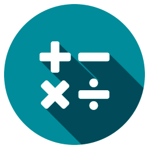
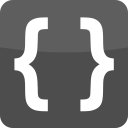
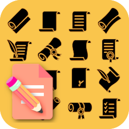
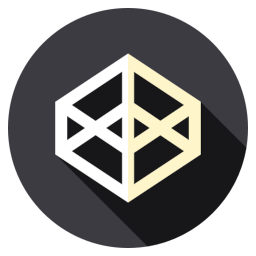
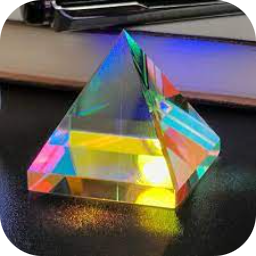

----------------------------------------------------------------

# Cool Icons Gadget

----------------------------------------------------------------

## Places

  

    
    <label> BASIC Group </label>
  

  

    
    <label> Jarvis </label>
  

  

    
    <label> FFMPEG </label>
  

  

    
    <label> Math JS </label>
  

## Projects

  

    
    <label> JSON Editor </label>
  

  

    
    <label> Dorothy Rockets </label>
  

  

    
    <label> Serpentine Port </label>
  

## Tools

  

    
    <label> Manuscript Editor </label>
  

  

    
    <label> Math Jax Editor </label>
  

  

    
    <label> JS Fiddle </label>
  

  

    
    <label> Code Pen </label>
  

  

    
    <label> Code Lab </label>
  

  

    
    <label> Code Sandbox </label>
  

  

    
    <label> P5 Sketches </label>
  

  

    
    <label> W3 Spaces </label>
  

  

    
    <label> Trinkets </label>
  

----------------------------------------------------------------

# Navigation

> [Web Menu](./../web-menu.html)

> [Folder Tree](./)
> [File System](./)

----------------------------------------------------------------

<footer id="footer">
  <input id="footer_input" onchange="perform(event)" />
</footer>

<header id="footer">
  

</header>

----------------------------------------------------------------

<!-- ~~~~~~~~~~~~~~~~~~~~~~~~~~~~~~~~~~~~~~~~~~~~~~~~~~~~~~~ -->

<!-- ~~~~~~~~~~~~~~~~~~~~~~~~~~~~~~~~~~~~~~~~~~~~~~~~~~~~~~~ -->

<!-- ~~~~~~~~~~~~~~~~~~~~~~~~~~~~~~~~~~~~~~~~~~~~~~~~~~~~~~~ -->

<!-- ~~~~~~~~~~~~~~~~~~~~~~~~~~~~~~~~~~~~~~~~~~~~~~~~~~~~~~~ -->

<textarea id="sce" class="hide"></textarea>

<!-- ~~~~~~~~~~~~~~~~~~~~~~~~~~~~~~~~~~~~~~~~~~~~~~~~~~~~~~~ -->

