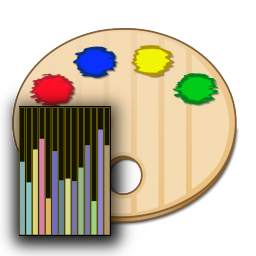

<head> <link rel="icon" href="./icons/palette-analyzer.png" /> </head>

<!-- ~~~~~~~~~~~~~~~~~~~~~~~~~~~~~~~~~~~~~~~~~~~~~~~~~~~~~~~ -->

[nancy]:    <https://sites.google.com/view/nancys-notebooks/home>
[sulu]:     <http://dave-ryzen/nav/sulu.html>
[raindrop]: <https://app.raindrop.io/my/45357558>
[ideaflip]: <https://ideaflip.com/>
[luminous]: <http://tiny.cc/jarvis-snipper-101>
[jimbo]:    <http://dave-omega/app/jarvis/toolkit/ncs/jimbo/jimbo-menu.html>

<!-- ~~~~~~~~~~~~~~~~~~~~~~~~~~~~~~~~~~~~~~~~~~~~~~~~~~~~~~~ -->

[cdn]: <https://nyteowldave.github.io/cdn/third-party.html>
[named-colors]: <http://dave-jefr/palettes/named-colors/named-colors.html>
[math-groups]: <http://dave-tower/demo/dot/md/math-groups.html>
[math-links]: <http://dave-probook/std/pubs/math/links.html>
[math-formulas]: <http://dave-probook/std/pubs/math/formulas.html>
[least-squares]: <http://dave-probook/std/pubs/math/least-squares.html>
[bell-curve]: <http://dave-probook/std/pubs/math/bell-curve.html>

<!-- ~~~~~~~~~~~~~~~~~~~~~~~~~~~~~~~~~~~~~~~~~~~~~~~~~~~~~~~ -->

[mdn-gfx]: <https://developer.mozilla.org/en-US/docs/Web/API/CanvasRenderingContext2D>
[math-js]: <https://mathjs.org/>
[glmatrix-js]: <https://glmatrix.net/docs/>
[raindrop-math]: <https://app.raindrop.io/my/46171960>

<!-- ~~~~~~~~~~~~~~~~~~~~~~~~~~~~~~~~~~~~~~~~~~~~~~~~~~~~~~~ -->

[me-tower]:
<http://dave-tower/demo/web/pal-anz-menu.html>
"Tower Edition"

[me-omega]:
<http://dave-omega/demo/web/pal-anz-menu.html>
"Omega Edition"

----------------------------------------------------------------

# [`☰` Palette Analyzer Menu][me-omega]

  

### `>>` FEATURING `<<`

> [`🎨` Palette Analyzer](./palette-analyzer.html)

----------------------------------------------------------------

## [`🗒️` Notes][nancy]

> [`🗒️` Palette Analyzer Notes](./palette-analyzer-notes.html)
> [`🗒️` Math Notes](./pal-anz-math-notes.html)
> [`🗒️` Navigation Notes](./pal-anz-nav-notes.html)
> [`🗒️` Jarvis Notes](./pal-anz-jarvis-notes.html)

----------------------------------------------------------------

## [`🧰` Toolkit][luminous]

> [`🧰` Math Jax](http://dave-legacy/math/latex/mathjax-test.html)
> [`🧰` Math Universe](http://dave-legacy/math/math-menu.html)
> [`🧰` HTML Color Names][named-colors]

----------------------------------------------------------------

## [`📦` Third Party Packages][cdn]

> [`📦` math.js][math-js]
> [`📦` glmatrix.js][glmatrix-js]

----------------------------------------------------------------

## [`🧨` Demos](./../demo-menu.html)

> [`🎇` Explosion Demo](./explode/explode-deux.html)

----------------------------------------------------------------

## [`💎` Gems][jimbo]

### Common Gems

> [`💎` Core Ops](./gems/core-ops.js)
> [`💎` Document Read-Write](./gems/doc-read-write.js)
> [`💎` Interpreter Lite](./gems/interpreter-lite.js)
> [`💎` JSON Ops](./gems/json-ops.js)
> [`💎` PCL Ultra](./gems/pcl-ultra.js)
> [`💎` Riccola Lite](./gems/riccola-lite.js)
> [`💎` Stateful Object](./gems/stateful.js)
> [`💎` Sulu](./gems/sulu.js)

### Explosion Gems

> [`💎` RGB](./explode/rgb.js)
> [`💎` Fire](./explode/fire.js)
> [`💎` Fire Palette](./explode/fire-palette.js)
> [`💎` Draw Pixel](./explode/draw-pixel.js)
> [`💎` Explosion](./explode/explosion.js)
> [`💎` Sprites](./explode/sprites.js)

### Pixel Map Gems

> [`💎` Core Ops](./pixmap/core-ops.js)
> [`💎` Fractal Palette 16](./pixmap/fractal-palette-16.js)
> [`💎` Geometry 2D](./pixmap/geom-2d.js)
> [`💎` Geometry 3D](./pixmap/geom-3d.js)
> [`💎` Geometry 4D](./pixmap/geom-4d.js)
> [`💎` Mandelbulb](./pixmap/mandelbulb.js)
> [`💎` Pixel Map](./pixmap/pixmap.js)
> [`💎` Poincare Disc](./pixmap/poincare-disc.js)
> [`💎` RGBA](./pixmap/rgba.js)
> [`💎` Scalar Math](./pixmap/scalar.js)
> [`💎` Vector Math](./pixmap/vector.js)

### Dial of Destiny Gems

> [`💎` Destiny Date](./destiny/destiny-date.js)

### Dodecahedron Gems

> [`💎` Cube](./dodec/cube.js)
> [`💎` Dodecahedron](./dodec/dodecahedron.js)
> [`💎` Matrix](./dodec/mtx.js)
> [`💎` Polygon](./dodec/polygon.js)
> [`💎` Screen](./dodec/screen.js)
> [`💎` Vector](./dodec/vec.js)

### Turtle Gems

> [`💎` Turtle Graphics](./turtle/api/turtle-graphics.js)

----------------------------------------------------------------

## [`💧` References][raindrop]

> [`👨‍👦‍👦` Math Groups][math-groups]
> [`📚` Math Links][math-links]
> [`📙` Least Squares][least-squares]
> [`📙` Bell Curve][bell-curve]
> [`📙` Math Formulas][math-formulas]
> [`📙` Math JS][math-js]
> [`📙` GL Matrix JS][glmatrix-js]
> [`📙` MDN Graphics][mdn-gfx]
> [`💧` Raindrop Math][raindrop-math]

----------------------------------------------------------------

## [`🧭` Navigation][sulu]

> [`☰` Web Menu](./web-menu.html)
> [`☰` Demo Menu](./../demo-menu.html)

> [`🌲` Folder Tree](./tree.php)
> [`🗃️` File System](./)

----------------------------------------------------------------

<!-- ~~~~~~~~~~~~~~~~~~~~~~~~~~~~~~~~~~~~~~~~~~~~~~~~~~~~~~~ -->

<!-- ~~~~~~~~~~~~~~~~~~~~~~~~~~~~~~~~~~~~~~~~~~~~~~~~~~~~~~~ -->

<!-- ~~~~~~~~~~~~~~~~~~~~~~~~~~~~~~~~~~~~~~~~~~~~~~~~~~~~~~~ -->

<!-- ~~~~~~~~~~~~~~~~~~~~~~~~~~~~~~~~~~~~~~~~~~~~~~~~~~~~~~~ -->

<!-- ~~~~~~~~~~~~~~~~~~~~~~~~~~~~~~~~~~~~~~~~~~~~~~~~~~~~~~~ -->

