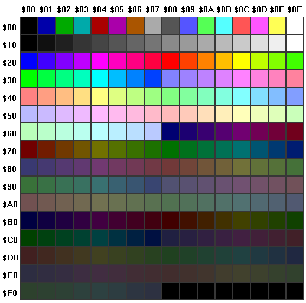

<link rel="stylesheet" href="help.css">
<style> 
.r { color: #FF2020; }
.g { color: #20FF20; }
.b { color: #2020FF; }
.icon {
    font-style: normal;
    font: 16pt sans-serif;
}
</style>

# Texture and Palette Example

## Warning
> This gets a little hairy.

---

# RGB Color Model

See: [RGB Color Model](https://en.wikipedia.org/wiki/RGB_color_model).

As you know, a __palette__ is nothing more than an _ordered list_ of color
definitions. A color may be defined in many different ways. We use
what's known as the __RGB Color Model__.

<aside> RGB is an acronym for Red, Green, and Blue.</aside>

Internally a palette is stored as an array of one or more __RGB triplets__. 

Each value in the triplet is called a __component__ (or a _channel_). In
other words, there's a _red component_, a _green component_, and a
_blue component_. Together they form a _triplet_.

In other words, any color is represented by a combination of different
amounts of these three <q>primary</q> colors. No these aren't the primary
colors you learned about while mixing paints in art class. But the concept
is the same.

Each component is stored as an integer. These numbers range from
0 to 255 which is also 2<sup>0</sup> to 2<sup>8</sup>-1. All the possible
values that can be represented in a _byte_ (or 8 _bits_) of data. 

By choosing these triplet values, you can define any of 
<code>256\*256\*256 = 2<sup>24</sup> = 16,777,216</code>
colors. Wow! That's nearly 17 million colors.

This range is known formally as __true color__ because it
represents the full gamut of colors distinguishable by the human eye.
To put it a different way, there are theoretically an infinite number
of possible colors. But the human eye can't tell the difference between
colors that are too similar. A range of 2<sup>24</sup> is about all
our eyes can handle.

Let's play with an example. Shown below is a very basic _color picker_
tool. Play around with the controls to make various colors.
Observe which mixtures of numbers produce various colors.

<div id="idColorPicker">
<!-- AUTO FILLED -->
</div>

The above tool allows you to create a <dfn>color definition</dfn>.
In the RGB color model, this is just three integers. Each integer 
is from the number series <code>[0, 1 ... 255]</code>. So there
are exactly <var>256</var> (<var>2<sup>8</sup></var>) possible
values to chose from.

The number at the bottom-left in the color picker is a 
[hexadecimal](https://en.wikipedia.org/wiki/Hexadecimal)
representation of the color.

Programmers use hexadecimal a lot. We call it <em>hex</em> for short.

This is the format used by 
[HTML](https://en.wikipedia.org/wiki/Web_colors#HTML_color_names) 
-- the language of most web sites. 

Its format is 
\#<span class="r">RR</span>
<span class="g">GG</span>
<span class="b">BB</span>, where:

<pre>
 # is a prefix indicating base-16 (hex)
 <span class="r">RR</span> is the red component (2 hex digits)
 <span class="g">GG</span> is the green component (2 hex digits)
 <span class="b">BB</span> is the blue component (2 hex digits)
</pre>


For example, I know from experience that the color __cerulean__ is:<br>

| Component | Decimal Value |  Hex Value |
| - | - | - |
| Red | 5 | #05 |
| Green | 184 | #B8 |
| Blue | 204 | #CC |

I could write it in **set notation** as <var>(5, 184, 204)</var> or 
in **HTML notation** as <var>#05B8CC</var>. Try it in the color 
picker and see for yourself.

There are lots of ways RGB color definitions may be expressed.
Here are a few:

| Example | Description |
| - | - |
| 5 184 204 | Space separated integers |
| 5,184,204 | Comma separated integers |
| (5,184,204) | Set notation |
| \{5,184,204\} | Set notation |
| [5,184,204] | Set notation |
| #05B8CC | Hexadecimal integer (HTML) |
| 0x05B8CC | Hexadecimal integer (C) |
| &H05B8CC | Hexadecimal integer (BASIC) |
| 05B8CCh | Hexadecimal integer (MASM) |
| 374988 | Decimal integer |

<br>

Some of the notations are of the 
[N-Tuple](https://en.wikipedia.org/wiki/Tuple) variety.
These are all some form of __set notation__. Also sometimes 
called:

* List
* Group
* Collection
* Array
* etc.

Essentially these all have three separate values to consider.

The other notations are various ways to express the color as a 
single integer value. In general, the single number variety uses 
this formula to combine individual R, G and B components into a
single integer value:

```javascript

total = red * 65536
      + green * 256
      + blue

  -- For Example --

374988 = 5 * 65536
       + 184 * 256  
       + 204
        
```

This single number may then be converted to hexadecimal and back
as needed:

```text

hex(374988) => 0x05B8CC
dec(0x05B8CC) => 374988

```

The above expression assumes some unspecified function 
named <code>hex</code> that accepts a decimal integer and converts
it into hexadecimal form. And another named <code>dec</code> that 
accepts a hexadecimal integer and converts it into decimal form.

Many modern calculators have these functions. Especially those that
offer a __programmer mode__.

Not only can the notation vary, but within any given notation each
of the color components may be expressed in a different
number system or a different scale. In the table below, all of
the examples show ways to define __cerulean__ in RGB. They all
use _set notation_.

| Example | Range |
| - | - |
| (5,184,204) | Decimal integers [0 ... 255] |
| (0.020,0.722,0.800) | Decimal real numbers [0.0 ... 1.0] |
| (2.0%,72.2%,80.0%) | Decimal real numbers [0.0% ... 100.0%] |
| (0x05,0xB8,0xCC) | Hex integers [0x00 ... 0xFF] |

The fractional numbers (shown on the second row) have been 
calculated using a technique called _normalization_. This is
accomplished by dividing each component by its maximum possible
value (<code>number/255</code>). The result is then a real number
in the range <code>[0.0 ... 1.0]</code>. We don't need a lot of
precision, so we've round each component to three decimal places.

The percentages (shown on the third row) are arrived at in a
similar manner. The difference is that we multiplied each
component by 100% (<code>number/255*100%</code>) before rounding
to one decimal place.

You might recognize this as first finding the ratio of a color
component to it's maximum value, then converting that ratio to
a percentage. With some rounding for compactness.

Now that you know how colors are defined, we can talk about lists
of colors. Also known as _palettes_.

---

# Palette

See: [Palette](https://en.wikipedia.org/wiki/Palette_(computing))

A palette is just a collection of _color definitions_. Even so, there
are some rules and typical usages. Technically speaking, a palette
could be thought of as a very simple bitmap. But it's not meant to
represent some image to a person (other than to show the colors 
themselves; paint/sketch apps allow the user to choose a color to
draw with, for example).

The primary rule of a palette is that the color definitions are
_ordered_. In other words, each of the entries in the palette has
an index number assigned to it. This allows colors to be
_looked up_ by their index.

Different size palettes are possible. Some common sizes include:
2, 16, 256 and 65536 colors. These became standardized in early
computer hardware (video adapters) and so this was reflected in
how images were represented in image file formats.

PhotoPlanet uses fixed-size palettes having 256 colors. It just so
happens that this is 16*16 as well, which makes the palette easy
to preview in a square screen area.

<aside>
We won't try to do anything fancy here like gamma correction.
We'll just use a plain old linear luminosity model.
</aside>

So, let's look at a _gray scale_ palette. This shows shades of gray
from pure black to pure white. 

Also, we'll just use a 16 color palette to save space. Imagine one
with 16 columns and 16 rows (256 total colors). That's what the app
would use.

<div id="idGrayTable">
<!-- AUTO FILLED -->
</div>

Notice how we've laid out the colors in a 2D table. So we could in fact
_look up_ a color using <code>(x, y)</code> coordinates. That is, by a
column number and a row number. But because the app stores the palette
internally as a single long row, that would require extra math.

We'll show the equation anyway, just for practice with bitmaps or textures.
Those do use <var>x</var> and <var>y</var> coordinate pairs, but are also
stored internally as a single long row of dots (pixels or texels).

What we need is a single __index number__ -- an integer that shows how
far into the palette (or other image) the desired entry exists. In other
words, we want to flatten the palette or image into a single line -- just
one row of colors. Preserving the proper order of course.

<aside>
<div>
<span class="icon">🙄
</span>
What's that? Why are the values one
less than their positions? Because the coordinates start at 0
rather than 1. So the 2<sup>nd</sup> column is at <var>x</var>=1
and the 3<sup>rd</sup> row is at <var>y</var>=2.
</div>
<div>
<span class="icon">🤔
</span>
This use of 0 or 1 as a starting point for counting things is always
an issue in math and computer programming. 
</div>
<div>

<span class="icon">👍
</span>
But we can handle it. We just have to known about it. Now we do.
</div>
</aside>

So let's say we want the color at the 2<sup>nd</sup> column and the
3<sup>rd</sup> row. We'll call <var>x</var> our column number 
and <var>y</var> our row number.

So <var>x</var>=1 and <var>y</var>=2. Or in set notation, 
<var>location</var> = (1,2).

The <q>actual</q> index (or _ordinal position_) of each entry is from a 
series that begins with 0 at the top-left corner and fills in the top row
first, then wraps around to the next row and continues. This counting
pattern repeats until all entries have been assigned an index.

The equation for converting 2D location to 1D index is:

```javascript

i = y * w + x

   -- OR --

index = row number 
      * number of columns 
      + column number

```

In the terse equation, <var>w</var> stands for <q>width</q>.

The important thing to understand here is that color <var>i</var> in
1D space is the same as color <var>(x,y)</var> in 2D space. We're just
using a different set of numbers to specify its location.

Plugging our (1,2) example into the equation yields:

```javascript

i = y * w + x

  x = 1 (column number)
  y = 2 (row number)
  w = 4 (columns per row)

   -- SO --
   
i = 2 * 4 + 1
i = 9

```

Using our gray scale color table, the actual color at this 
index of <var>i</var>=9 would be <var>(153,153,153)</var>.

One major difference between a palette and a bitmap is that the
palette shouldn't contain any duplicate entries. All of the colors
should be unique.

Beyond this, palettes may be sorted and sectioned into ranges of
similar colors. This allows for certain special effects. Some palettes
may be changed dynamically (while an app is running). Again this is
how some special effects are accomplished.

For example, shown below is a very famous palette. It's the 256 color
palette from the very first
[VGA](https://en.wikipedia.org/wiki/Video_Graphics_Array)
video adapters. These were considered a breakthrough because they
allowed a much greater level of realism than the EGA adapter's 
16 color palettes.

<div>

</div>

You'll notice that the final 8 entries are black. The reason is that
this allowed some customization without breaking any images that relied
on the preprogrammed colors. Although all entries could be modified, this
took a lot of extra work to do properly without causing clashes with
other apps. A lot of _color remapping_ took place in those old days when
the hardware itself required palettes. Nowadays this is merely a historical
curiosity. Almost all modern video hardware uses 24-bpp full color images.
Palettes in hardware are still often an option. But their use has all but
vanished.

Even in software (in apps), the use of palettes is a dying practice. But
for our little rotating ball app, they're quite advantageous.

In summary, remember that although both palettes and bitmaps contain
color definitions, they serve different purposes.

---

# Bitmaps

Digitized photographic images are represented as __bitmaps__. More accurately,
__pixmaps__ (but that term was never popularized in the public).

There are a wide range of ways that bitmaps may be represented in memory or
in files. Some of these formats use palettes and some have each pixel contain
a color definition.

<aside>* <strong>bpp</strong> is an acronym that stands
for <strong>bits per pixel</strong>.
</aside>

The bitmap format we're interested in is the so-called 24 bpp<sup>*</sup> true
color format. That is to say, each pixel consists of 24 bits of data. This is
further broken down into 3 color components (R,G,B). Each color component is
8-bits = 1-byte wide.

<div>

</div>

<script src="http://localhost/nyteowl/api/2020/v8/require.js"></script>
<script src="example-1.js"></script>
