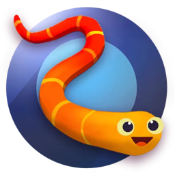
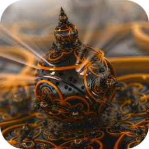
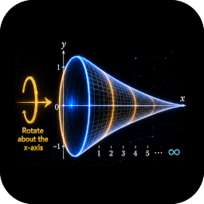
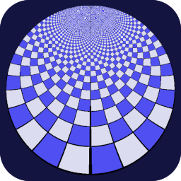
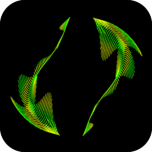

<head> <link rel="icon" href="favicon.ico" /> </head>

[sulu]: <http://dave-ryzen/nav/sulu.html>
[raindrop]: <https://app.raindrop.io/my/45357558>

[mynotepad]:
<https://nyteowldave.github.io/notes/mynotepad.html>
"Morpheus Edition"

[ncs-tools]:
<http://dave-tower/app/jarvis/toolkit/ncs/ncs-menu.html>
"Tower Edition"

[x-lane]:
<http://tiny.cc/express-lane>
"Express Lane"

<!-- ~~~~~~~~~~~~~~~~~~~~~~~~~~~~~~~~~~~~~~~~~~~~~~~~~~~~~~~ -->

[me-tower]:
<http://dave-tower/demo/web/web-menu.html>
"Tower Edition"

[me-omega]:
<http://dave-omega/demo/web/web-menu.html>
"Omega Edition"

----------------------------------------------------------------

# [`☰` Web Menu][me-omega]

> ( `Dave's 🧨 Demos` )

----------------------------------------------------------------

## `🧰` Toolkit

> [Palette Analyzer](./palette-analyzer.html)
> [My Notepad][mynotepad]
> [NCS Tools][ncs-tools]
> [Express Lane][x-lane]

----------------------------------------------------------------

# `🧨` Demo Apps ~ Coming Soon!

----------------------------------------------------------------

<!--

[x] destiny		[x] dodec 		[x] explode
[x] lines		[x] lissajous	[x] pixmap
[x] planet		[x] polyhedra	[x] snake-hunt
[ ] sprites		[x] turtle		[ ] zephyr

[ ] sprites		[ ] zephyr

-->

  

    
    <label> Snake Hunt </label>
  

  

    
    <label> Dodecahedron </label>
  

  

    
    <label> Explode Deux </label>
  

  

    
    <label> Turtle Graph </label>
  

  

    
    <label> Mandelbulb </label>
  

[TODO]
  

    
    <label> lines </label>
  

[TODO]
  

    
    <label> lissajous </label>
  

[TODO]
  

    
    <label> pixmap </label>
  

[TODO]
  

    
    <label> planet </label>
  

[TODO]
  

    
    <label> polyhedra </label>
  

<h2> 🥁 Ported to BASIC </h2>

  

    
    <label> Gabriel's Horn </label>
  

  

    
    <label> Dial of Destiny </label>
  

  

    
    <label> Poincare Disc </label>
  

  

    
    <label> Turtle </label>
  

<h2> ⌛ On Hold </h2>

  

    
    <label> Pixel Map </label>
  

  

    
    <label> Explode </label>
  

  

    
    <label> Kurt's Swimmer </label>
  

----------------------------------------------------------------

## `🗒️` Demo Notes

- [`🗒️` Explode Notes](./explode/explode-notes.html)
- [`🗒️` Ikeda Attractor Notes](./pixmap/ikeda-attractor-notes.html)
- [`🗒️` Mandelbrot 3D P-Code](./pixmap/mandelbrot-3d-pcode.html)
- [`🗒️` Pixmap Notes](./pixmap/pixmap-notes.html)

----------------------------------------------------------------

## `🗂️` Workspaces

### Featured

- [`📁` destiny](./destiny/)
- [`📁` dodec](./dodec/)
- [`📁` explode](./explode/)
- [`📁` lines](.lines/)
- [`📁` lissajous](./lissajous/)
- [`📁` pixmap](./pixmap/)
- [`📁` polyhedra](./polyhedra/)
- [`📁` snake-hunt](./snake-hunt/)
- [`📁` sprites](./sprites/)
- [`📁` turtle](./turtle/)
- [`📁` zephyr](./zephyr/)

### Resources

- [`📁` claude](./claude/)
- [`📁` codepen](./codepen/)
- [`📁` gemini](./gemini/)

### Assets

- [`📁` api](./api/)
- [`📁` app](./app/)
- [`📁` art](./art/)
- [`📁` gadgets](./gadgets/)
- [`📁` gems](./gems/)
- [`📁` icons](./icons/)
- [`📁` peaches](./peaches)
- [`📁` templates](./templates/)

----------------------------------------------------------------

## [`💧` References][raindrop]

- [D-Drive](https://dropbox.com)
- [Cairo Graphics](https://www.cairographics.org/)
    - [Chris Thomasson](https://www.facebook.com/chris.thomasson.31/)
- [Mathematical Tiling and Tessellation](https://www.facebook.com/groups/391950357895182)

----------------------------------------------------------------

## [`🧭` Navigation][sulu]

> [`☰` Dodecahedron Menu](./dodec/dodec-menu.html)
> [`☰` Explode Menu](./explode/explode-menu.html)
> [`☰` Pixmap Menu](./pixmap/pixmap-menu.html)
> [`☰` Demo Menu](./../demo-menu.html)

> [`✅` Demo Checklist](./../demo-checklist.html)

> [`🃏` Cool Icons Gadget](./gadgets/cool-icons.html)

> [`🌲` Folder Tree](./tree.php)
> [`🗃️` File System](./)

----------------------------------------------------------------

<!-- ~~~~~~~~~~~~~~~~~~~~~~~~~~~~~~~~~~~~~~~~~~~~~~~~~~~~~~~ -->

<!-- ~~~~~~~~~~~~~~~~~~~~~~~~~~~~~~~~~~~~~~~~~~~~~~~~~~~~~~~ -->

<!-- ~~~~~~~~~~~~~~~~~~~~~~~~~~~~~~~~~~~~~~~~~~~~~~~~~~~~~~~ -->

<!-- ~~~~~~~~~~~~~~~~~~~~~~~~~~~~~~~~~~~~~~~~~~~~~~~~~~~~~~~ -->

<!-- ~~~~~~~~~~~~~~~~~~~~~~~~~~~~~~~~~~~~~~~~~~~~~~~~~~~~~~~ -->
