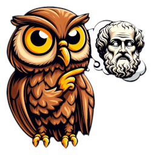

<!-- ~~~~~~~~~~~~~~~~~~~~~~~~~~~~~~~~~~~~~~~~~~~~~~~~~~~~~~~ -->

[me-omega]:
<http://dave-omega/demo/web/web-rtc/rambling-and-musing.html>
"Omega Edition"

<!-- ~~~~~~~~~~~~~~~~~~~~~~~~~~~~~~~~~~~~~~~~~~~~~~~~~~~~~~~ -->

<h1 id="_T_"> Rambling and Musing </h1>

----------------------------------------------------------------

  

----------------------------------------------------------------

> [`🔗` Omega][me-omega]
> [`🔗` File System](./)

> [`🔗` Related Links](./related-links.html)

----------------------------------------------------------------

## A Few Tasks ...

- Finish Web RTC Test Client TURN Modifications
- Test Client is test-client.001.html (no MD Source File)
- Test and Debug Web RTC Client and Server
- Get Rid of Periods (`.`) in Client Messages

----------------------------------------------------------------

## Reminders

- Credentials for TURN are in Chad the Chatter (Tower)
- Look for Elvira in Chat Filename
- Future Troubleshooting Should Begin with Current Notes
- I Made Pretty Extensive Notes During Setup and DevOps
- Web RTC Server Uses IP Port 8282

----------------------------------------------------------------

<!-- ~~~~~~~~~~~~~~~~~~~~~~~~~~~~~~~~~~~~~~~~~~~~~~~~~~~~~~~ -->

