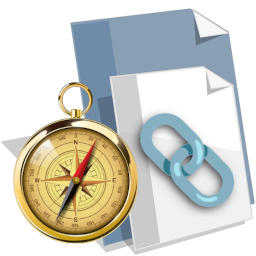

<head> <link rel="icon" href="hikaru.png" /> </head>

<!-- ~~~~~~~~~~~~~~~~~~~~~~~~~~~~~~~~~~~~~~~~~~~~~~~~~~~~~~~ -->

[me-omega]:
<http://dave-omega/demo/web/web-rtc/related-links.html>
"Omega Edition"

<!-- ~~~~~~~~~~~~~~~~~~~~~~~~~~~~~~~~~~~~~~~~~~~~~~~~~~~~~~~ -->

<h1 id="_T_"> Related 🔗 Links </h1>

----------------------------------------------------------------

  

----------------------------------------------------------------

> [`🔗` Omega][me-omega]
> [`🔗` File System](./)

----------------------------------------------------------------

# `🔗` Third Party Pages

----------------------------------------------------------------

## `🔗` Chat and Search

----------------------------------------------------------------

  <a href="https://gemini.google.com/app/648a3941355c7570">🔗 Gemini Chat #1</a>
  <a href="https://share.google/aimode/8aOGthntyiihNuwSK">🔗 Gemini Chat #2 </a>
  <a href="https://google.com">🔗 Google Search </a>

----------------------------------------------------------------

## `🔗` Specific Reference

----------------------------------------------------------------

  <a href="https://github.com/coturn/coturn">🔗 COTURN Repo </a>
  <a href="https://datatracker.ietf.org/doc/html/draft-uberti-behave-turn-rest-00">🔗 TURN REST API </a>

----------------------------------------------------------------

## `🔗` General Reference

----------------------------------------------------------------

  <a href="https://developer.mozilla.org/en-US/docs/Web/API/WebRTC_API">🔗 MDN </a>
  <a href="https://javascript.info/">🔗 JS Info </a>
  <a href="https://nodejs.org/docs/latest/api/">🔗 Node </a>
  <a href="https://www.w3schools.com/js/default.asp">🔗 W3 Schools </a>

----------------------------------------------------------------

## `🔗` IDE

----------------------------------------------------------------

  <a href="https://codepen.io/your-work">🔗 Code Pen </a>
  <a href="https://www.tutorialrepublic.com/codelab.php">🔗 Code Lab </a>
  <a href="https://editor.p5js.org/nyteowldave64/sketches">🔗 P5 Sketches </a>
  <!-- [[  <a href="">🔗 </a> ]] -->

----------------------------------------------------------------

# `🔗` More NCS Pages

----------------------------------------------------------------

  <a href="http://dave-omega/app/chatter/chatter.html">🔗 Chad the Chatter </a>
  <a href="http://dave-omega/demo/web/message-api/page-1.html">🔗 Message API Demo </a>

----------------------------------------------------------------

# `🔗` Web RTC Demo Pages

----------------------------------------------------------------

> [`🔗` Node Server](./server.js)
> [`🔗` Test Client #1](./test-client-001.html)
> [`🔗` Server Setup](./server-setup.html)
> [`🔗` CoTurn Setup](./coturn-setup.html)
> [`🔗` Rambling Notes](./rambling-and-musing.html)
> [`🔗` Related Links](./related-links.html)

----------------------------------------------------------------

<!-- ~~~~~~~~~~~~~~~~~~~~~~~~~~~~~~~~~~~~~~~~~~~~~~~~~~~~~~~ -->

