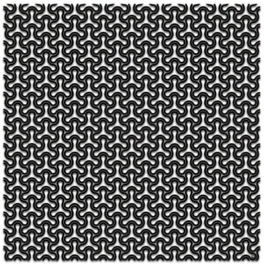
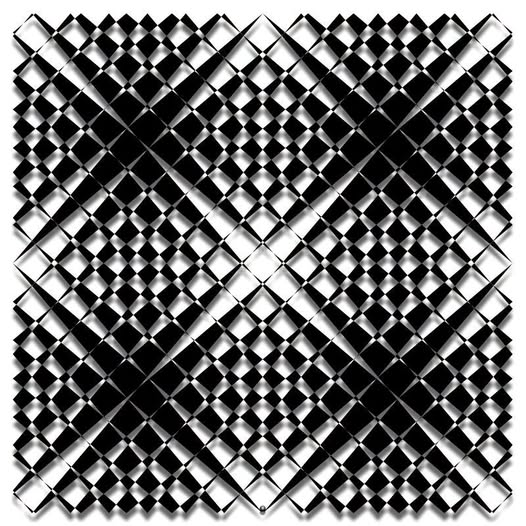
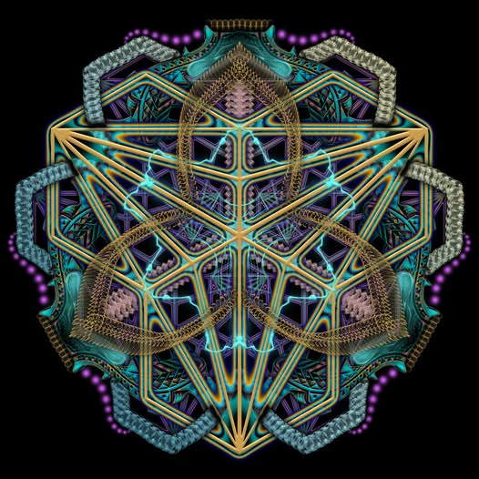
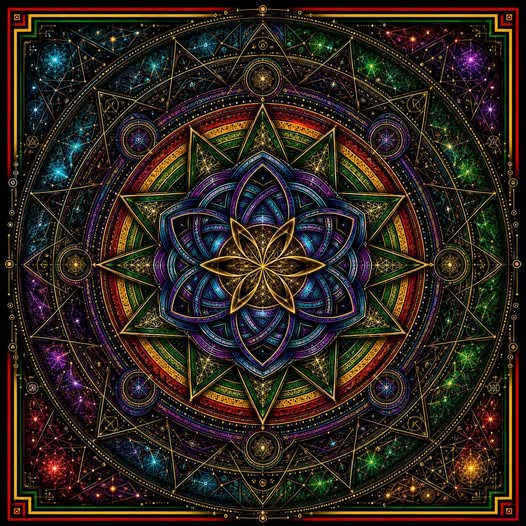

<head> <link rel="icon" href="favicon.ico" /> </head>


[textures]:
<http://dave-omega/demo/web/art/texture/texture-menu.html>
"Omega Edition"

[me-omega]:
<http://dave-omega/demo/zx/lissajous.html>
"Omega Edition"

----------------------------------------------------------------

# [Lissajous Demo][me-omega]

----------------------------------------------------------------

```basic
1 REMark ~ 'lissajous' 3d wave knot
2 REMark ~ Author : David Mainprize
3 REMark ~ For : BASIC Programming Language
4 REMark ~ Platform : Sinclair QL
10 SCALE 2, -2, -1
20 PAPER 1 : INK 7 : CLS : CLS#0
30 A=0 : t=0
40 x-0 : y=0
50 inc=0
60 REPeat loop
70 x=sin(2*t)*cos(A) - cos(3*t)*sin(A)
80 x=sin(2*t)*sin(A) + cos(3*t)*cos(A)
90 POINT x,y
100 t=t+1
110 A=A+0.5
120 inc=inc+1 : IF inc=2000 THEN EXIT loop
130 END REPeat loop
```

----------------------------------------------------------------

# JavaScript Source Code

----------------------------------------------------------------

<div center>
  <textarea id="sce" wrap="off" class="fill"></textarea>
</div>

<script>
lissajous_source = ( `

function setup() {
   const sw = sh = 600;
   Xform.scale( sw / 3.4, sh / 2.4, 1 );
   Xform.xlate( sw / 2.0, sh / 2.0, 0 );
   Background( "black" );
   Pen( "gold" );
}

function render( erase=true ) {
   const pt={};
   let A=0, t=0;
   let inc = 2000;
   if ( erase ) { Background(); }
   while ( --inc > 0 ) {
     pt.x = sin( 2*t )*cos( A ) - cos( 3*t )*sin( A );
     pt.y = sin( 2*t )*sin( A ) + cos( 3*t )*cos( A );
     Xform.apply( pt, pt );
     Pen.dot( pt.x, pt.y );
     t = t + 1;
     A = A + 0.5;
   }
};

;
; ( 1 ) && setup()
; ( 1 ) && render()
;
; console.log( "OK!" )
;

` );
</script>

----------------------------------------------------------------

# Surface

----------------------------------------------------------------

<div center>
  <canvas id="surface"></canvas>
</div>

----------------------------------------------------------------

# [Textures][textures]

----------------------------------------------------------------

<section id="texture_section">
 
 
 
 
</section>

----------------------------------------------------------------

<footer>
 <input id="footer_input" onchange="perfect(event)" />
 <div id="btn_run" action="run()" onclick="action(event)">▶️</div>
 <div id="btn_hud" action="hud()" onclick="action(event)">◩</div>
 <div id="btn_zms" action="zms()" onclick="action(event)">💠</div>
</footer>

<header>
  <div id="messages"></div>
</header>

----------------------------------------------------------------

<style>
html, body {
    color : lemonchiffon;
    background : midnightblue;
}
body {
    margin-top    : 64px;
    margin-bottom : 42vh;
}
.center ,
[center] { text-align : center; }
.hide ,
[hide] {
    display : none !important;
}
</style>

<style>
footer {
    box-sizing : border-box;
    position : fixed;
    margin   : 0;
    width    : 100%;
    left     : 0;
    bottom   : 0;
    overflow : clipped;
    text-align : left;
    padding  : 4px 1ch;
    background : lemonchiffon;
    color : midnightblue;
}
footer * {
    box-sizing : border-box;
    display : inline-block;
    font  : 11pt monospace;
}
footer input {
    width : calc( 100% - 160px );
    padding : 4px 1ch;
    margin-right : 10px;
}
footer div {
    width  : 4ch;
    height : 3ch;
    line-height : 3ch;
    text-align : center;
    color : lemonchiffon;
    background : rgba(0,0,200,0.64);
    border-radius : 2ch;
    cursor : pointer;
}
</style>

<style>
.fill {
    display : inline-block;
    width   : calc( 100% - 10ch );
    min-width  : 300px;
    min-height : 300px;
    resize  : vertical;
    overflow : scroll;
    outline  : none;
    border   : none;
    border-top-left-radius : 1ch;
    font : 13pt monospace;
    tab-size : 4;
}
</style>

<style>
#surface {
    display : inline-block;
    width   : 600px;
    height  : 600px;
    min-width  : 200px;
    min-height : 200px;
    border : 1px dotted gold;
}
</style>

<style>
.texture {
    display : inline-block;
    margin  : 5px;
    width   : 100px;
    height  : auto;
}
</style>

<!-- ~~~~~~~~~~~~~~~~~~~~~~~~~~~~~~~~~~~~~~~~~~~~~~~~~~~~~~~ -->

<script>
; iwm = Object.keys( window ).sort()
</script>

<script>
; doc = document
</script>

<script>
; cls =()=> console.clear()
; agn =()=> location.reload();
</script>

<!-- ~~~~~~~~~~~~~~~~~~~~~~~~~~~~~~~~~~~~~~~~~~~~~~~~~~~~~~~ -->

<script src="./../web/gems/core-ops.js"></script>
<script src="./../web/gems/json-ops.js"></script>
<script src="./../web/gems/texture-ops.js"></script>

<script src="./../web/api/core-api.js"></script>
<script src="./../web/api/hud.js"></script>
<script src="./../web/api/lumina-gfx.js"></script>

<!-- ~~~~~~~~~~~~~~~~~~~~~~~~~~~~~~~~~~~~~~~~~~~~~~~~~~~~~~~ -->

<script>
function main( event ) {
    try {
        doc . title = "Lissajous Demo";
        sce.value = lissajous_source;
        init_buttons();
        init_tex_all();
        prepare_rgba_colors();
        Surface.zoom = function() {
            surface.requestFullscreen();
            surface.focus();
        };
    } catch ( e ) {
        crashed ( e );
    }
}
</script>

<script>
addEventListener( "load", main );
</script>

<!-- ~~~~~~~~~~~~~~~~~~~~~~~~~~~~~~~~~~~~~~~~~~~~~~~~~~~~~~~ -->

<script>
function crashed( e ) {
    crashed.error = ( e );
    alert ( e );
    throw ( e );
}
</script>

<!-- ~~~~~~~~~~~~~~~~~~~~~~~~~~~~~~~~~~~~~~~~~~~~~~~~~~~~~~~ -->

<script>
function edit_basic() {}
</script>

<script>
function edit_javascript() {}
</script>

<script>
function accept_javascript() {}
</script>

<!-- ~~~~~~~~~~~~~~~~~~~~~~~~~~~~~~~~~~~~~~~~~~~~~~~~~~~~~~~ -->

<script>
function init_buttons() {
    btn_run.title = "▶️ Run HUD Script";
    btn_hud.title = "◩ Toggle HUD Editor";
    btn_zms.title = "💠 Zoom Surface";
}
</script>

<!-- ~~~~~~~~~~~~~~~~~~~~~~~~~~~~~~~~~~~~~~~~~~~~~~~~~~~~~~~ -->

<script>
function zms() {
    try {
        const srf = Surface();
        hud.zoom( srf );
    } catch ( e ) {
        zms.error = ( e );
        throw ( e );
    }
}
</script>

<!-- ~~~~~~~~~~~~~~~~~~~~~~~~~~~~~~~~~~~~~~~~~~~~~~~~~~~~~~~ -->

<script>
function action( event ) {
    const ops = action;
    try {
        ops.error = "";
        ops.event = mine( event );
        const sender = ( event.target );
        const k  = sender.textContent.trim();
        const js = sender.getAttribute( "action" );
        if ( js ) {
            const s = window.eval( js );
            console.log( k, js, s );
        } else {
            throw new Error( `No Action is Assigned : "${k}"` );
        }
    } catch ( e ) {
        ops.error = ( e.message );
        crashed ( e );
    }
}
</script>

<!-- ~~~~~~~~~~~~~~~~~~~~~~~~~~~~~~~~~~~~~~~~~~~~~~~~~~~~~~~ -->

<script>
function perfect( event ) {
    perform( event );
}
</script>

<!-- ~~~~~~~~~~~~~~~~~~~~~~~~~~~~~~~~~~~~~~~~~~~~~~~~~~~~~~~ -->

<script>
function init_tex( tex ) {
    tex.title = tex.alt = Texture.filename( tex.src );
    tex.classList.add( "texture" );
    const st = tex.style;
    st.cursor = "pointer";
    tex.onclick = function( e ) {
        mine( e );
        const tex = ( e.target );
        Texture.render( tex );
    };
}
</script>

<script>
function init_tex_all() {
    const grp = texture_section;
    const m = arr( grp.querySelectorAll( "IMG" ) );
    m.forEach( init_tex );
}
</script>

<script>
function add_tex( url ) {
    const tex = elx( "img" );
    tex.src = ( url );
    init_tex( tex );
    const grp = texture_section;
    return ( grp.appendChild( tex ) );
}
</script>

<!-- ~~~~~~~~~~~~~~~~~~~~~~~~~~~~~~~~~~~~~~~~~~~~~~~~~~~~~~~ -->


